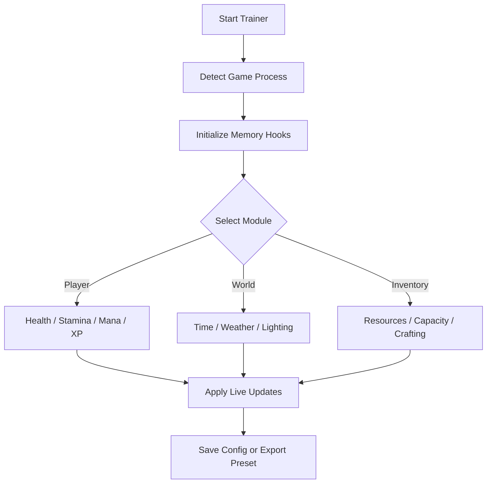

# Whiskerwood Trainer 🐾

Under the twilight canopy of Whiskerwood, mystery grows like moss — and now, **you** hold the magic to master it. The **Whiskerwood Trainer** is your companion in exploration and survival, letting you bend the rules of stamina, magic, crafting, and time itself. From peaceful foraging to spellcraft experimentation, this tool makes every journey through the woods your own enchanted tale.

---

## 🌲 Overview

*Whiskerwood* blends survival, exploration, and gentle fantasy — but sometimes, curiosity deserves no limits. This trainer offers complete control over player stats, weather, inventory, and magical energy, designed for creators, testers, and wanderers who wish to shape the world at their own pace.

---

## ⚙️ Core Features

* **Infinite Stamina & Health:** Roam freely without worry of exhaustion or danger.
* **Unlimited Mana / Magic Energy:** Cast spells and enchantments endlessly.
* **Instant Crafting:** Create potions, charms, and tools instantly.
* **XP & Level Multiplier:** Grow your skills faster or reach mastery instantly.
* **Unlimited Inventory Capacity:** Carry everything you collect without limits.
* **Time & Weather Control:** Pause the day, summon rain, or freeze twilight.
* **Resource Generator:** Spawn rare plants, essences, or gems directly into your satchel.
* **Invulnerability Toggle:** Ideal for testing or cinematic exploration.

[!NOTE]

> All features function in **offline or creative sessions** and revert once the trainer is closed. Your story remains untouched.

---

## 🧩 Compatibility

| Platform           | Status | Notes                                   |
| ------------------ | ------ | --------------------------------------- |
| Windows 10         | ✅ Full | Stable under DX11 & DX12                |
| Windows 11         | ✅ Full | Overlay smooth at 144Hz                 |
| Steam              | ✅      | Auto-path recognition                   |
| Epic Games         | ⚠️     | Manual directory setup required         |
| Controller Support | ✅      | Radial trainer access via trigger combo |

---

## ⚡ Quick Setup

1. Extract `Whiskerwood_Trainer.zip` into your game folder.
2. Run as Administrator:

   ```bash
   Whiskerwood_Trainer.exe --safe
   ```
3. Launch *Whiskerwood*.
4. Press **F7** to open the Trainer overlay.
5. Toggle features or load your saved profile (`wanderer.ini`, `archmage.ini`, `creative.ini`).

[!IMPORTANT]

> Launch the trainer before starting your save file to ensure perfect variable synchronization.

---

## 🌿 Trainer Flow



---

## 🧺 Example Configurations

```ini
[wanderer_mode]
stamina=infinite
health=infinite
mana=unlimited
weather=clear
xp_multiplier=1.5
time_freeze=false

[archmage_mode]
mana=unlimited
xp_multiplier=4.0
crafting_speed=instant
invulnerability=true
fog_density=0.2
```

Activate instantly with:

```bash
whiskerwood --load archmage_mode.ini
```

[!WARNING]

> Increasing XP above `5x` may cause UI misalignment in skill menus — safe to use but purely visual.

---

## ❓ FAQ

**Q: Can I use this trainer online?**
A: No. It’s designed for offline, single-player, or creative exploration only.

**Q: Will it damage my save?**
A: No. All changes are temporary and vanish after session close.

**Q: How do I revert settings mid-game?**
A: Press **Ctrl + R** or use the “Reset All” toggle in the overlay.

**Q: Is it compatible with future updates?**
A: Yes, thanks to the trainer’s auto-offset detection system.

**Q: Can I modify hotkeys?**
A: Absolutely. Edit `/config/hotkeys.json` to create your own control layout.

---

## 🧠 Advanced Tools

* **Free Camera Mode:** Perfect for screenshots or cinematic storytelling.
* **Environmental Editor:** Adjust sunlight hue, particle glow, and fog intensity.
* **Creature AI Freeze:** Stop nearby fauna for observation or photography.
* **Charm Creator:** Combine magical essences to test new spell recipes instantly.

[!NOTE]

> Pair *Charm Creator* with *Free Camera* to record unique spell showcases.

---

## 🌲 Final Thoughts

The **Whiskerwood Trainer** is more than a cheat — it’s a wand of creation. Wander freely, test the mechanics of magic, and enjoy a world unbound by exhaustion or scarcity. The forest is vast and ancient, but with this tool, it’s yours to shape and explore endlessly.

---

*The forest breathes, the stars listen, and your magic flows without end — Whiskerwood Trainer lets you become one with the wild.*
